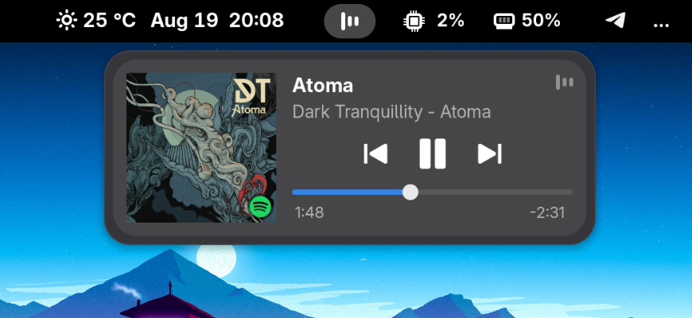
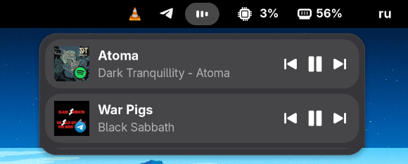
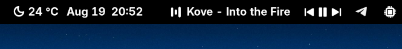
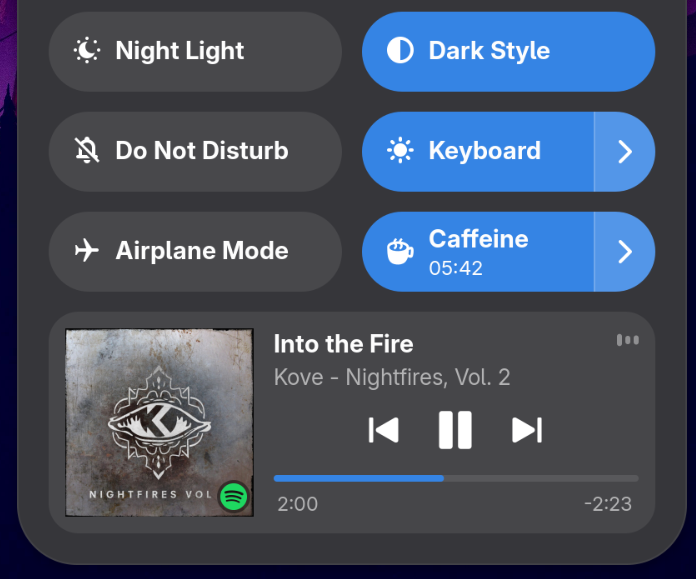
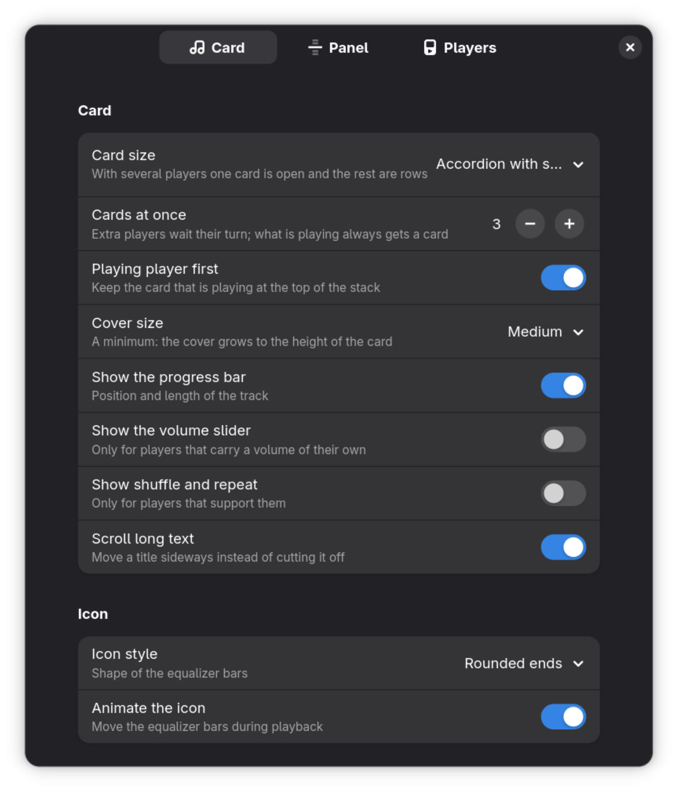

<p align="center">
  
</p>

<h1 align="center">Now Playing Card</h1>

<p align="center">
  An animated equalizer in the top panel and a media card for any MPRIS player.
</p>

<p align="center">
  
  
  <a href="https://github.com/sponsors/epogonii"></a>
</p>

## What does this extension do?

Shows what is playing: an animated equalizer in the top panel and a media card
with cover art, a seekable progress bar and transport controls for any MPRIS
player. Nothing to configure to get going, nothing to install beside it.

## Screenshots

The card in its own popup, opened from the panel button:

<p align="center">
  
</p>

Several players at once: the one playing keeps the open card, the rest wait as
rows and open on a click.

<p align="center">
  
</p>

The track and the transport in the panel itself:

<p align="center">
  
</p>

Or no button of its own, and the card at the bottom of Quick Settings:

<p align="center">
  
</p>

Preferences:

<p align="center">
  
</p>

## Features

- Every MPRIS player, however it is packaged: native, Flatpak, Snap
- Cover art however the player hands it over: a file, a URL, or the picture
  itself inline; a browser that writes the file a moment after it announces the
  track is waited for, and a player whose artwork sits in a sandbox the shell
  cannot read falls back to its own application icon
- Artwork fills the square it is given, cropped rather than squeezed, whatever
  shape it arrived in
- Seekable progress bar: exact `SetPosition` where the player reports a track
  id, a relative `Seek` otherwise
- Volume slider for players that carry a volume of their own
- Shuffle and repeat where the player supports them
- Skip buttons only when the player says it can skip
- A file with no tags is named after itself, so a local track is not left
  carrying the player's own name on both lines
- Transport, track text, wheel and middle click in the panel itself, so a track
  can be changed without opening anything
- Click the cover to switch to the player's own window
- Several players share one popup as an accordion; a row opened by hand stays
  open while its player is playing
- Three cards at once by default, as many as ten if you want them; a player
  that starts playing always gets one of the places
- One popup width whatever the track is called, so nothing jumps between songs
- Own panel button or embedded in Quick Settings, and the top-bar icon can be
  there always, only while a player runs, or never
- Equalizer bars with rounded ends, square ends, or rounded ends in colours
  that keep moving
- Follows the system light and dark theme and switches with it
- Hides GNOME's own media controls while it runs, and gives them straight back
  when it stops

---

## How to install

#### From extensions.gnome.org

[extensions.gnome.org/extension/10736/now-playing-card](https://extensions.gnome.org/extension/10736/now-playing-card/)

#### From a release

Every tag builds the same zip that goes to extensions.gnome.org:

```sh
gnome-extensions install --force nowplaying@epogonii.github.io.shell-extension.zip
gnome-extensions enable nowplaying@epogonii.github.io
```

#### From the sources

```sh
gnome-extensions pack --force --schema=schemas/org.gnome.shell.extensions.nowplaying.gschema.xml \
    --extra-source=stylesheet.css --extra-source=stylesheet-light.css \
    --extra-source=stylesheet-dark.css --extra-source=LICENSE
gnome-extensions install --force nowplaying@epogonii.github.io.shell-extension.zip
gnome-extensions enable nowplaying@epogonii.github.io
```

GNOME Shell 45 or newer, on Wayland or X11, and nothing else. Log out and back
in first (X11: `Alt+F2`, then `r`): a running shell keeps an extension's
JavaScript in memory for the life of the process, so new code needs a new shell.
Preferences apply immediately.

---

## Preferences

`gnome-extensions prefs nowplaying@epogonii.github.io`

Three pages, in the order the window shows them.

### Card

| Setting | Meaning |
| --- | --- |
| Card size | Accordion with several players, always full, or always compact |
| Cards at once | How many players the popup shows, one to ten |
| Playing player first | Keep the card that is playing at the top |
| Cover size | Smallest artwork in a full card; it grows to the height of the card |
| Show the progress bar | Position and length of the track |
| Show the volume slider | For players that carry a volume of their own |
| Show shuffle and repeat | For players that support them |
| Scroll long text | Move a title sideways instead of cutting it off |
| Icon style | Square ends, rounded ends, or cycling colours |
| Animate the icon | Move the equalizer bars during playback |

### Panel

| Setting | Meaning |
| --- | --- |
| Location | Own panel button, or embedded in Quick Settings |
| Panel area / Position | Where the button sits, panel mode only |
| Show in the top bar | Always, only while a player is running, or never |
| Track in the panel | Nothing, title, or artist and title next to the icon |
| Text width | Longest the panel text may get, in pixels |
| Fixed text width | Keep that width even for a short track |
| Scrolling over the button | Nothing, switch tracks, or change volume |
| Controls in the panel | Previous, play and next next to the icon |
| Middle click | Nothing, play or pause, or next track |

### Players

| Setting | Meaning |
| --- | --- |
| Hide the built-in media controls | Keep GNOME's own player out of the notification list |
| Ignored players | Picked from the installed apps, or typed by hand |

---

## Reporting issues

Include, please:

- Extension version
- GNOME Shell version and your distribution
- The player, and how it is installed (native, Flatpak, Snap)
- `journalctl --user -b 0 -o cat /usr/bin/gnome-shell | grep nowplaying`
- A screenshot where it makes sense

---

## Support

The extension is free and stays free. If it earned a coffee:

<p align="center">
  <a href="https://github.com/sponsors/epogonii"></a>
  <a href="https://www.paypal.com/paypalme/pogonii"></a>
</p>

| | |
| --- | --- |
| GitHub Sponsors | **[github.com/sponsors/epogonii](https://github.com/sponsors/epogonii)**, monthly or one time |
| PayPal | **[paypal.me/pogonii](https://www.paypal.com/paypalme/pogonii)** |
| Bitcoin | `18KtJEw8gt2oyicszwMUkbAKMHHXS9nwKR` |
| Ethereum | `0x4f2fb6a154526a72d612afa2e3a8129e30ca0996` |
| Cardano | `DdzFFzCqrhsmpnmUqivufj3TmDzksP4HKzcksRUNVr8xA4Gbj7PngV6TfkZuqUqeeKxp138t2Ftd1HypLFkUQ8F1hGtEmyhTP9VnZcUt` |

The same links sit at the bottom of the extension's preferences.

---

## License

GPL-2.0-or-later, see [LICENSE](LICENSE).
